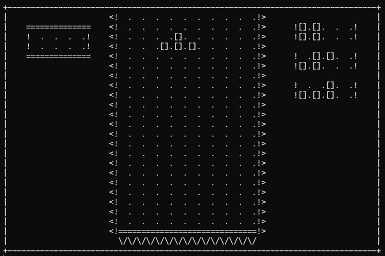
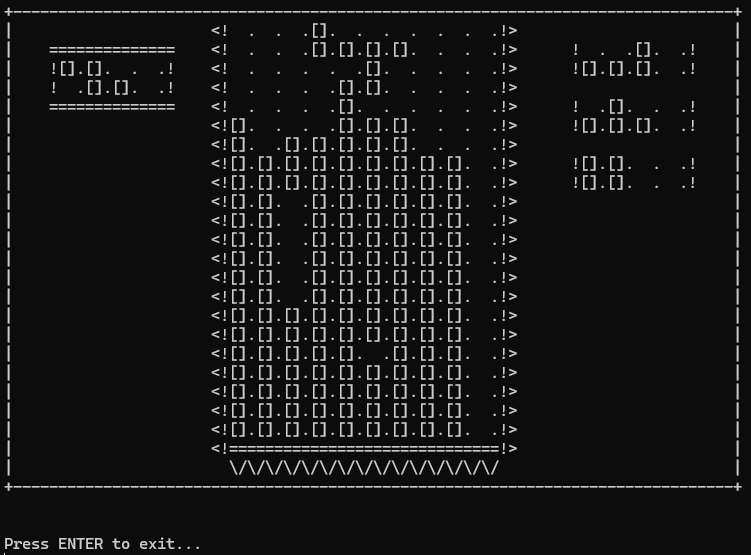

# Tetris on CLI

There is nothing more to add. It's just Tetris on a command-line interface. Currently no UI, straight to gaming.

## Features

-   move left and right with `a` and `d`, rotate left and right with the arrow keys (left arrow for left rotation, right arrow for right rotation)
-   `s` to move the piece down
-   `q` to hold / swap the tetrominoes out
-   uses the Super Rotation System (SRS) to perform rotations and wall kicks
-   currently uses `_getch()` and `_kbhit()` to fetch key presses (only Windows compatible)

## Pictures

The game layout

Game Over

